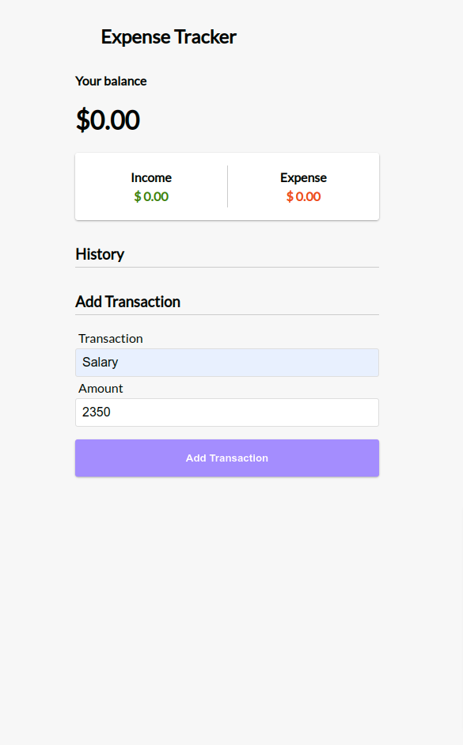

# Expense Tracker Project

This is a simple expense tracker app built using ReactJs. In the app user can be able to input transactions and the amount of money of every transaction in order to get a list of expenses and income with different style each, a total income and total expense indicator and the balance. The app persists user's data using localStorage in order to make the app usable even though there is no back-end application or database.

## Adding transaction screenshot

## Transaction list screenshot

![] (images/Expense Tracker \_list.png)

The user can also delete the transactions by clicking on them and the income, expense and total balance will recalculate.

## Deleting transactions example

## How it works

The app has one transaction list where all the entries are stored in a single state but in order to get income and expenses the app iterates over the transaction list to summ the amounts of positive and negative transactions and stores the total income and total expenses in two separated states and finally set the balance based on the positive and negative totals

#

This project was bootstrapped with [Create React App](https://github.com/facebook/create-react-app).

## Available Scripts

In the project directory, you can run:

### `npm start`

Runs the app in the development mode.\
Open [http://localhost:3000](http://localhost:3000) to view it in your browser.

The page will reload when you make changes.\
You may also see any lint errors in the console.

### `npm test`

Launches the test runner in the interactive watch mode.\
See the section about [running tests](https://facebook.github.io/create-react-app/docs/running-tests) for more information.

### `npm run build`

Builds the app for production to the `build` folder.\
It correctly bundles React in production mode and optimizes the build for the best performance.

The build is minified and the filenames include the hashes.\
Your app is ready to be deployed!

See the section about [deployment](https://facebook.github.io/create-react-app/docs/deployment) for more information.
